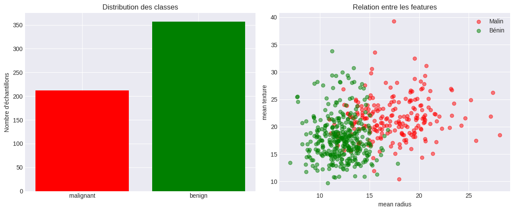

# 📊 Deep Learning Project - MLP, CNN & Seq2Seq

Ce dépôt contient l'implémentation complète et documentée d'un projet de Deep Learning structuré en trois parties majeures, utilisant **PyTorch** et **Python**. L'objectif est d'explorer et de comparer différentes architectures de réseaux de neurones sur des tâches de classification, de régression et de traitement du langage naturel (NLP).

Le projet est divisé en deux versions de référence :
*   **Version 1 (Initiale) :** Classification Breast Cancer (MLP), Classification de vêtements (CNN sur Fashion-MNIST) et Traduction FR → EN (Seq2Seq).
*   **Version 2 (Optimisée) :** Régression California Housing (MLP), Classification de chiffres (CNN sur MNIST) et Traduction EN → DE (Seq2Seq avec Attention).

---

## 📁 Structure du Dépôt

```text
Deep-Learning-Project-MLP-CNN-Seq2Seq/
├── Deep-Learning-Project-MLP-CNN-Seq2Seq.ipynb   # Notebook Jupyter principal
├── Rapport_Deep_Learning_JOUICHAT_Khadija.pdf    # Rapport de projet final
├── README.md                                     # Documentation du projet
├── download.png                                  # Visualisations & Courbes d'apprentissage
├── download (*).png                              # Graphiques et métriques exportés
└── Screenshot *.png                              # Captures d'écran des résultats de synthèse
```

---

## 🛠️ Partie I : Multi-Layer Perceptron (MLP)

### 1. Version 1 : Classification Binaire (Breast Cancer Dataset)
*   **Dataset :** Wisconsin Breast Cancer (569 échantillons, 30 caractéristiques).
*   **Objectif :** Classifier les tumeurs comme malignes (Malin) ou bénignes (Bénin).
*   **Architectures comparées :**
    1.  `nn.Sequential` : Structure linéaire simple avec Dropout et Batch Normalization.
    2.  `MLPClassifier` (Classe personnalisée) : Structure flexible avec couches paramétrables.
*   **Initialisation des poids :** Comparaison des performances et des distributions de gradients entre les méthodes *Gaussian*, *Constant*, *Xavier* et *Kaiming*.

<p align="center">
  
  
</p>

*   **Résultats d'apprentissage :**
    - Précision (Accuracy) sur le jeu de test : **~98%**.
    - La méthode d'initialisation de Xavier/Kaiming montre une convergence nettement plus rapide et stable par rapport à une initialisation constante ou gaussienne naïve.

<p align="center">
  
  
</p>

---

### 2. Version 2 : Régression (California Housing Dataset)
*   **Dataset :** California Housing (20 640 échantillons, 8 features).
*   **Objectif :** Prédire la valeur médiane des maisons par district.
*   **Modifications de l'architecture :** Retrait de la couche d'activation finale (ReLU/Sigmoid) pour permettre des prédictions continues, utilisation de la perte **MSE (Mean Squared Error)**.
*   **Performance obtenue :**
    - **R² Score :** `0.8011` (80.11% de la variance expliquée).
    - **MSE :** `0.2631`
    - **MAE :** `0.3548`
    - **RMSE :** `0.5129`

<p align="center">
  
</p>

---

## 🖼️ Partie II : Convolutional Neural Network (CNN)

### Classification d'images (MNIST Dataset)
*   **Dataset :** MNIST (60 000 images d'entraînement, 10 000 de test, 28x28 pixels en niveaux de gris).
*   **Objectif :** Classifier les chiffres manuscrits de 0 à 9.

<p align="center">
  
</p>

*   **Architecture du modèle :**
    - Couche Conv1 (1 canal d'entrée, 16 canaux de sortie, noyau 5x5, padding 2).
    - Activation ReLU & MaxPool2d (noyau 2x2).
    - Couche Conv2 (16 canaux d'entrée, 32 canaux de sortie, noyau 5x5).
    - Activation ReLU & MaxPool2d.
    - Couche Fully Connected (FC) projetant vers les 10 classes de chiffres.
*   **Performance obtenue :**
    - Précision globale de test (Accuracy) : **99.43%**.

<p align="center">
  
  
</p>

*   **Visualisation des Feature Maps (Couche Conv1) :**
    - Analyse de la réponse des 16 filtres convolutionnels sur un échantillon (le chiffre 7). On observe que les premiers filtres se spécialisent dans la détection des contours horizontaux, verticaux et des contrastes locaux.
*   **Comparaison MLP vs CNN :**
    - Le CNN surpasse largement le MLP sur MNIST en conservant la structure spatiale des pixels et en limitant le nombre de paramètres grâce au partage des poids (weight sharing).

<p align="center">
  
  
</p>

<p align="center">
  
</p>

---

## 🔠 Partie III : Sequence-to-Sequence (Seq2Seq) avec Attention

### Traduction Automatique Anglais → Allemand (EN → DE)
*   **Dataset :** 80 paires de phrases bilingues préparées.
*   **Vocabulaire :** 104 tokens uniques en anglais (source), 107 tokens uniques en allemand (cible).

<p align="center">
  
  
</p>

*   **Architecture du modèle :**
    - **Encodeur :** GRU bidirectionnel (Embedding 64, Hidden 128, 2 couches, Dropout 0.3).
    - **Attention :** Mécanisme d'attention calculant des scores d'alignement entre les états cachés de l'encodeur et du décodeur.
    - **Décodeur :** GRU avec concaténation du vecteur de contexte d'attention pour prédire le mot suivant.

<p align="center">
  
</p>

*   **Stratégies de décodage comparées :**
    1.  **Greedy Decoding :** Sélection du token ayant la probabilité maximale à chaque étape. Précision : **75.0%** (15/20 phrases correctes).
    2.  **Beam Search (k=3) :** Maintien des $k$ meilleures hypothèses de traduction à chaque étape. Précision : **75.0%** (15/20 phrases correctes).

<p align="center">
  
</p>

*   **Comparaison des cellules récurrentes (RNN vs LSTM vs GRU) :**
    - Entraînement de trois modèles de prédiction du prochain mot avec les mêmes hyperparamètres.
    - **Résultats de perte de validation finale :**
      - **Simple RNN :** `5.4558` (perte rapide d'informations due au gradient évanouissant).
      - **LSTM :** `7.1097` (surapprentissage plus marqué sur ce très petit dataset).
      - **GRU :** `5.9375` (excellent compromis entre capacité de mémoire et vitesse de convergence).

<p align="center">
  
  
</p>

---

## 📈 Tableau Comparatif Global (Synthèse Version 2)

| Modèle / Tâche | Dataset | Architecture clé | Métrique de Performance principale |
| :--- | :--- | :--- | :--- |
| **MLP (Régression)** | California Housing | Linéaire (3 couches) + BatchNorm + Dropout | **R² Score : 0.8011** |
| **CNN (Classification)** | MNIST | 2x Conv2d + MaxPool + FC | **Accuracy : 99.43%** |
| **Seq2Seq (Traduction)** | EN → DE | GRU + Attention de Luong | **Précision Décodage : 75.0%** |

<p align="center">
  
  
</p>

---

## 📘 Rapport Final
Le rapport théorique complet détaillant l'ensemble des formules mathématiques (attention, backpropagation), les choix architecturaux et l'analyse critique des résultats est disponible dans le fichier PDF suivant :
*   [Rapport_Deep_Learning_JOUICHAT_Khadija.pdf](Rapport_Deep_Learning_JOUICHAT_Khadija.pdf)
